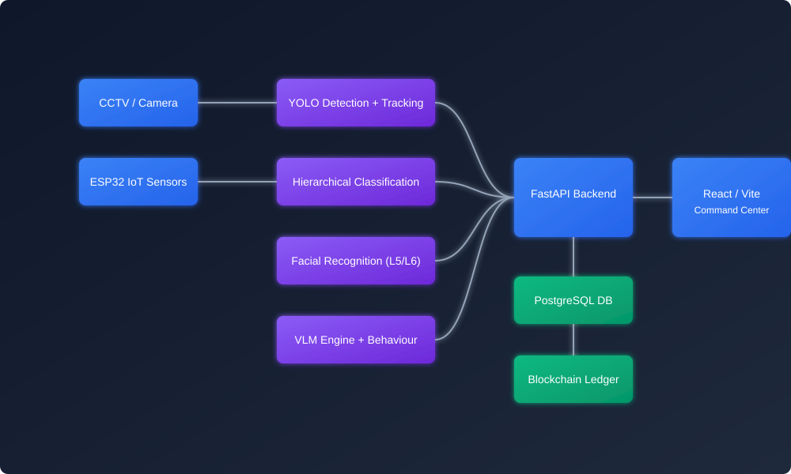
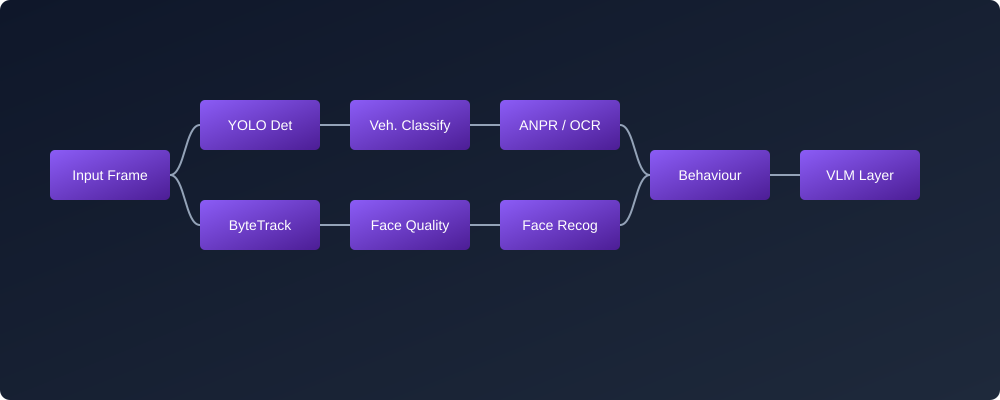

<div align="center">
  
# VLM Surveillance Engine

**Vision-Language Multi-Modal Security Operations Center**



[](https://python.org)
[](https://reactjs.org/)
[](https://fastapi.tiangolo.com/)
[](https://ultralytics.com)
[](https://pytorch.org/)

</div>

---

## 1. Project Overview

The VLM Surveillance Engine is an advanced, multi-modal computer vision and security intelligence platform. It merges traditional edge-based surveillance operations with cutting-edge Deep Learning, Facial Recognition, Vision-Language Models (VLMs), and immutable Blockchain auditing. Rather than simply recording video, the system actively parses scenes to track human expressions, classify military versus civilian vehicles, read license plates, and analyze real-time behaviour anomalies—orchestrated through a unified React command center.

## 2. Problem Statement

Modern surveillance networks generate massive volumes of passive data, overwhelming human operators. Security threats such as unauthorized military vehicle incursion, stationary loitering, expressional hostility, or perimeter breaches require immediate context-aware responses. Relying solely on human monitoring leads to missed events and delayed reaction times.

## 3. Objectives

- **Automate Scene Understanding:** Continually monitor video feeds for people, vehicles, and behavioural anomalies.
- **Hierarchical Classification:** Filter high-risk entities (e.g., Military vehicles) from civilian traffic.
- **Biometric Auditing:** Detect and assess human faces, expressions, and perform identification against enrolled databases.
- **Immutable Evidence:** Anchor critical events directly to an Ethereum blockchain ledger.
- **Hardware Integration:** Interface directly with edge sensors (PIR, Ultrasonic, IR) via ESP32.

## 4. Key Features

- **Real-Time Object Tracking:** DeepSORT / ByteTrack tracking of humans and vehicles.
- **Hierarchical Vehicle AI:** Custom-trained MobileNetV2 network differentiating military vs normal traffic.
- **Facial Intelligence (L5/L6):** Quality-gated facial detection, emotional expression analysis (Angry, Calm, Uncertain), and embedding matching.
- **ANPR Engine:** Real-time Automatic Number Plate Recognition for tracked vehicles.
- **Vision-Language Modelling:** `OpusVLMWrapper` for deep, multi-modal contextual reasoning of complex security events.
- **Blockchain Auditor:** Automatic Ethereum/Ganache anchoring of security events for tampering protection.
- **IoT Hardware Triggers:** ESP32 integration for physical sensor inputs and buzzer alarms.

---

## 5. System Architecture

The project is built on a highly modular pipeline connecting Edge processing, AI analysis, Backend routing, and Frontend visualization.

<div align="center">
  
</div>

- **L1/L2 (Core Vision):** Frame extraction, YOLOv8 detection, and hierarchical vehicle classification.
- **L3 (Behaviour):** Track history, movement vectors, and anomaly detection (e.g. loitering, speeding).
- **L5 (Face Quality):** Facial cropping, sharpness/quality assessment, and emotional modelling.
- **L6 (Face Recognition):** Identity embedding, enrollment, and database matching.
- **VLM Layer:** Semantic querying of scene snapshots.
- **Backend/IoT:** FastAPI routing, WebSocket telemetry, and ESP32 hardware bridges.

---

## 6. End-to-End Pipeline

1. **Input:** Video stream or Camera feed ingested via OpenCV.
2. **Detection:** YOLOv8 detects bounding boxes for Persons and Vehicles.
3. **Tracking:** ByteTrack assigns persistent IDs.
4. **Cropping & Routing:** Vehicles are sent to the MobileNet classifier and ANPR. Persons are sent to the L5/L6 facial engines.
5. **Behaviour Engine:** Tracks are analyzed for stationary timeouts or night-time activity.
6. **VLM Verification:** Complex events are passed to the VLM wrapper for contextual confirmation.
7. **Event Engine:** High-confidence alerts are logged to PostgreSQL, hashed, and sent to the Blockchain Auditor.
8. **Dashboard:** Events stream via WebSockets to the Vite/React UI.

---

## 7. AI / Machine Learning Architecture

| Model | Framework | Purpose | Input | Output |
|-------|-----------|---------|-------|--------|
| **YOLOv8s** | Ultralytics/PyTorch | Base object detection | Frame | BBoxes (Person, Vehicle) |
| **ByteTrack** | Native Python | Object tracking & ID association | BBoxes | Persistent Track IDs |
| **MobileNetV2** | PyTorch | Vehicle hierarchical classification | Vehicle Crop | Military / Normal |
| **MobileNetV2 (Finetuned)** | PyTorch | Military subtype classification | Military Crop | Army Truck, Tank, etc. |
| **EasyOCR** | PyTorch | Automatic Number Plate Recognition | Plate Crop | Text String |
| **Face Detector** | OpenCV (YuNet) | Facial extraction | Person Crop | Face BBox |
| **Face Embedder** | ONNX/PyTorch | Identity matching | Face Crop | 128D Vector |
| **OpusVLMWrapper** | API Wrapper | Contextual scene reasoning | Frame + Text | Semantic Event String |

---

## 8. Vehicle Intelligence & ANPR

The system uses a custom **Hierarchical Classifier**:
1. **Level 1:** Classifies the vehicle crop as `Military` or `Normal` (Civilian).
2. **Level 2 (Military Subtype):** If `Military`, it evaluates subtypes to identify specific threats.
3. **Level 2 (PSNA Bus):** If `Normal`, it evaluates custom models (e.g., PSNA University buses).

Simultaneously, the ANPR module attempts to extract text from the vehicle rear/front, passing the license plate string into the unified tracking payload.

---

## 9. Behaviour Analysis & Anomalies

Implemented rules in `L3/suspicious_activity.py` and `L3/behaviour.py`:

- **Stationary Person:** Triggers if a `Person` track centroid moves less than threshold `X` for `> 15 seconds`.
- **Night Activity:** Triggers if activity occurs during specified night hours (e.g., 22:00 - 05:00).
- **Movement Anomalies:** Detects abnormal vector speeds based on tracking history.
- **Facial Expression:** Triggers on prolonged `Angry` expressions from `L5/expression_analyzer.py`.

---

## 10. IoT / Hardware Architecture

The project interfaces with physical hardware via `iot/esp32_client.py`.

**Hardware Flow:**
`Sensors (PIR/Ultrasonic)` → `ESP32` → `Wi-Fi (HTTP)` → `FastAPI Backend` → `Alert Center / Buzzer`

**Supported Hardware:**
- ESP32 Microcontroller
- PIR Motion Sensors
- HC-SR04 / Ultrasonic Sensors
- Buzzer Modules for physical alarm triggers

---

## 11. Backend & Frontend Architecture

**Backend (FastAPI):**
- Unified server (`VLM_Surveillance_Project/backend/unified_server.py`) serving REST endpoints and WebSockets on port `8000` / `8123`.
- Consumes AI events and broadcasts them to the dashboard.

**Frontend (React/Vite):**
- Domain-specific views: `LiveConsole`, `HumanMonitoring`, `VehicleMonitoring`, `AlertCenter`.
- Pure data consumer: Renders live stats and MJPEG streams strictly from backend payloads. No heavy processing on the client.

---

## 12. Database & Blockchain Audit

**Database:**
- PostgreSQL (`localhost:5433`).
- Stores historical events, enrolled faces (`L6`), and vehicle metadata.

**Blockchain Auditor (`CCTV/prototype/blockchain_auditor.py`):**
- Connects to a local Ethereum network (Ganache) on `localhost:8545`.
- Hashes incoming PostgreSQL events via SHA-256.
- Commits a 0-ETH transaction containing the hash to the blockchain, logging the TxID to `audit_ledger.json`.

---

## 13. Project Folder Structure

```text
D:\VLM
├── CCTV/
│   └── prototype/               # Blockchain auditor & edge pipeline prototypes
├── docs/                        # Project documentation & SVG assets
├── iot/                         # ESP32 communication scripts
├── L_5/                         # Face Detection, Quality & Expression Analysis
├── L_6/                         # Face Enrollment, Embedding & Recognition
├── models/                      # Pretrained YOLO & custom PyTorch models
└── VLM_Surveillance_Project/    # Core System
    ├── backend/                 # FastAPI unified server
    ├── dashboard/               # React / Vite frontend UI
    ├── L1/                      # Video ingestion & frame processing
    ├── L2/                      # Vehicle classification & ANPR
    ├── L3/                      # Behaviour, tracking & suspicious activity
    └── L4/                      # Pipeline runner & subsystem integration
```

---

## 14. Technology Stack

| Category | Technology | Purpose |
|----------|------------|---------|
| **AI / CV** | PyTorch, Ultralytics YOLO, OpenCV | Detection, tracking, classification |
| **Backend** | FastAPI, Uvicorn, Python 3.10+ | API Server & WebSocket Orchestration |
| **Frontend** | React, Vite, JavaScript | High-performance SPA Command Center |
| **Hardware** | ESP32, C/C++ | Physical sensor and alarm integration |
| **Database** | PostgreSQL, SQLAlchemy | Persistent event and identity storage |
| **Security** | Web3.py, Ganache (Ethereum) | Immutable ledger auditing |

---

## 15. Code Component Inventory

| Module | File | Responsibility |
|--------|------|----------------|
| **FastAPI Server** | `VLM_Surveillance_Project/backend/unified_server.py` | Main API, WebSockets, system orchestrator. |
| **Frontend UI** | `VLM_Surveillance_Project/dashboard/src/views/*` | React UI for monitoring and alerts. |
| **Pipeline Runner** | `VLM_Surveillance_Project/L4/pipeline_runner.py` | Connects cameras to the AI layer. |
| **Tracker** | `VLM_Surveillance_Project/L3/tracker.py` | ByteTrack/DeepSORT integration. |
| **Behaviour Engine** | `VLM_Surveillance_Project/L3/suspicious_activity.py` | Analyzes tracks for anomalies (stationary, etc). |
| **Hierarchical Classifier** | `VLM_Surveillance_Project/L2/vehicle_classifier.py` | MobileNetV2 military vs normal detection. |
| **Face Quality** | `L_5/face_quality.py` | Assesses face blur, visibility, and matchability. |
| **Blockchain Auditor** | `CCTV/prototype/blockchain_auditor.py` | Anchors events to Ganache blockchain. |
| **IoT Client** | `iot/esp32_client.py` | Bridges physical sensors to backend alerts. |
| **VLM Wrapper** | `models/vlm/opus_model.py` | Interface for deep visual language reasoning. |

---

## 16. Installation & Execution

### Prerequisites
- Python 3.10+
- Node.js & npm
- PostgreSQL (running on port 5433)
- Ganache (running on port 8545 for auditing)

### Setup & Run
1. **Activate Environment:**
   ```bash
   cd D:\VLM\VLM_Surveillance_Project
   .venv\Scripts\activate
   ```
2. **Start the Backend:**
   ```bash
   python backend/unified_server.py
   # Runs on http://localhost:8123
   ```
3. **Start the Frontend:**
   ```bash
   cd dashboard
   npm install
   npm run dev
   # Runs on http://localhost:5173
   ```
4. **Start the Blockchain Auditor (Optional):**
   ```bash
   cd D:\VLM\CCTV\prototype
   python blockchain_auditor.py
   ```

---

## 17. API Reference

| Method | Endpoint | Purpose |
|--------|----------|---------|
| `GET` | `/api/health` | System status and subsystem availability |
| `GET` | `/api/events` | Historical events from the database |
| `GET` | `/api/stream` | MJPEG video stream feed |
| `POST` | `/api/persons/enroll`| Enroll a new face into the database |
| `WS` | `/ws` | Real-time telemetry, stats, and live alerts |

---

## 18. Testing and Validation

- **`run_phase10_validation.py`**: Facial Recognition pipeline. **PASSED** (0.00% False Match Rate).
- **`run_all_tests.py`**: End-to-end integration tests. (Requires PostgreSQL on 5433).
- **`test_vlm.py`**: Tests synthetic frames against the VLM semantic engine.
- **`test_esp32_integration.py`**: Tests hardware pings and alarm fallbacks.

**Known Limitations:**
- Heavy dependency on GPU acceleration; CPU inference drops pipeline FPS significantly.
- ANPR accuracy decreases rapidly on acute camera angles.
- Blockchain auditor requires a local Ganache instance; failure to connect bypasses anchoring.

---

## 19. Final Summary

The VLM Surveillance Engine represents a fully realized fusion of Physical Security, Edge AI, and Web3 Auditing. By leveraging hierarchical Deep Learning pipelines for vehicles and humans, analyzing temporal behaviour, and rendering everything through a decoupled React dashboard, the system guarantees high-accuracy threat detection with tamper-proof blockchain accountability.
